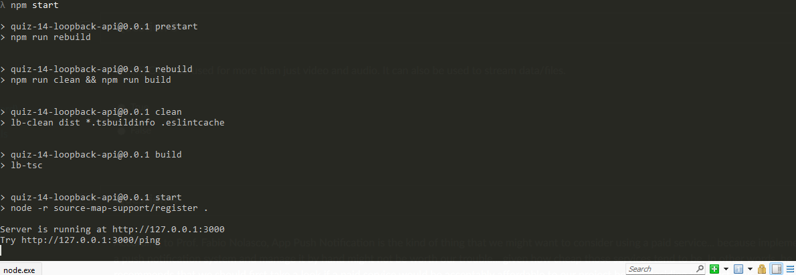
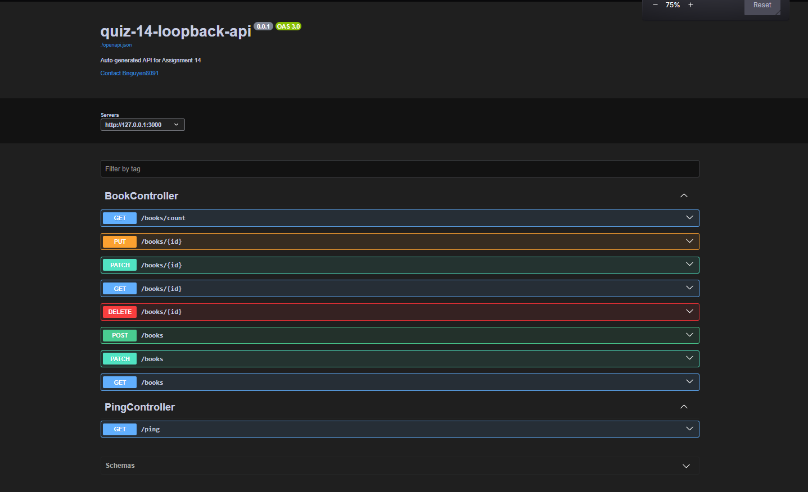

---

# Assignment 12 – Auto-Generated API Using LoopBack 4

This repository contains my implementation of **Quiz 14 – Automatic API Generator**.
For this assignment, I used **LoopBack 4** to automatically generate a fully functional REST API, including models, datasources, repositories, and controllers.
The final API exposes CRUD endpoints for a `Book` model and includes an interactive Swagger-style API Explorer.

---

## Overview

LoopBack 4 is a Node.js framework that provides powerful CLI tools capable of generating complete APIs with minimal manual coding.
This project demonstrates:

* Automatic API scaffolding
* Model and schema generation
* Repository creation for CRUD operations
* Controller generation for RESTful endpoints
* In-memory datasource configuration
* Testing via the built-in `/explorer` UI

---

## Tools Used

* **LoopBack 4 CLI** – automatic scaffolding
* **Node.js + npm** – runtime & package management
* **TypeScript** – LoopBack’s primary language
* **Swagger UI Explorer** – interactive API testing

---

## Project Structure (Auto-Generated)

| Component      | Description                                       |
| -------------- | ------------------------------------------------- |
| **Model**      | `Book` model with `id`, `title`, `author`, `year` |
| **Datasource** | In-memory datasource (`db.datasource.ts`)         |
| **Repository** | CRUD repository (`BookRepository`)                |
| **Controller** | REST controller exposing CRUD endpoints           |
| **Explorer**   | Auto-generated Swagger documentation              |

---

## Book Model Definition

The auto-generated model includes:

* `id` – auto-generated string ID
* `title` – required string
* `author` – required string
* `year` – optional number

---

## Steps I Followed 

### 1️ Install LoopBack CLI

```bash
npm install -g @loopback/cli
```

### 2️ Create the LoopBack Application

```bash
lb4 app
```

### 3️ Generate the Model

```bash
lb4 model
```

Defined fields: `id`, `title`, `author`, `year`.

### 4️ Create an In-Memory Datasource

```bash
lb4 datasource
```

### 5️ Generate the Repository

```bash
lb4 repository
```

### 6️ Generate the REST CRUD Controller

```bash
lb4 controller
```

### 7️ Start the API Server

```bash
npm install
npm start
```

Then open the API Explorer:

```
http://localhost:3000/explorer
```

---

## How to Run This Project

Clone the repository:

```bash
git clone https://github.com/Bnguyen8091/Assignment-12-Loopback-API.git
cd Assignment-12-Loopback-API
```

Install dependencies:

```bash
npm install
```

Start the application:

```bash
npm start
```

Open in browser:

```
http://localhost:3000/explorer
```

---

## Screenshots






---

## Tests

Run tests with:

```bash
npm test
```

---

## Additional LoopBack Commands

```bash
npm run build          # Build the project
npm run clean          # Clean build artifacts
npm run rebuild        # Full rebuild
npm run lint           # Lint source files
npm run lint:fix       # Auto-fix linting issues
npm run openapi-spec   # Export OpenAPI spec
npm run migrate        # Migrate database schemas
```

---

## Learn More

To continue exploring LoopBack 4, see the official docs:
[https://loopback.io/doc/en/lb4/](https://loopback.io/doc/en/lb4/)

---

